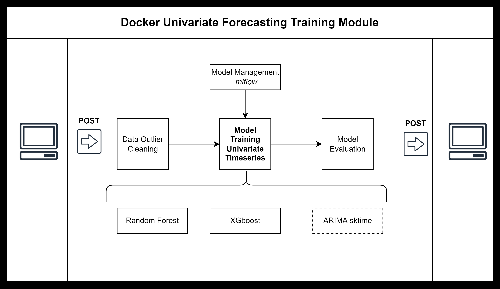

# Docker Containerized Jupyter Notebook 

## Hyperparameter Optimization using parallel model training in Spark


[](https://hub.docker.com/r/jupyter/pyspark-notebook/)
[](https://hub.docker.com/r/jupyter/pyspark-notebook/)
[](https://hub.docker.com/r/jupyter/pyspark-notebook/ "jupyter/pyspark-notebook image size")

GitHub Actions in the <https://github.com/jupyter/docker-stacks> project builds and pushes this image to Docker Hub.

This docker stack allows to train forecasting models using any Machine Learning (sklearn based) or Statistical Model with the help of **pypspark**. Moreover, hyperparameter optimization via the package **hyperopt** is also available. 

Currently **RandomForestRegression** and **XGBRegressor** can be used to train models using temporal cross validation and then make inferences based on the best model. 

Model training and management is done via **mlflow**. 

In order to reproduce the results initialize docker. If using WSL2:

```bat
sudo /etc/init.d/docker start
```

If using Linux based distributed System: 

```bat
sudo systemctl start docker
```
Then, create image from Docker file: 

```bat
sudo docker build -t pysparkforecast:latest .
```

Run interactive Jupyter Lab session from Docker Image: 


```bat
sudo docker run -it --rm -p 8888:8888 -v "${PWD}":/home/jovyan/work pysparkforecast:latest
```




